# Fastfetch Android

I am very happy to announce Fastfetch-style system information natively on Android!

Fastfetch Android gives you detailed information about your Android device and is designed to run on just about any Android device. It currently supports Android 7.1 and above, along with `arm64-v8a`, `armeabi-v7a`, `x86`, and `x86_64`.

It also includes lots of customization options!

## Tested Devices

## Phones

- Motorola Moto Z4
- Google Pixel 7 Pro
- Realme GT 7T (RMX5085)
- Xiaomi 12T 5G (22071212AG)
- Samsung Galaxy S21 (SM-G991U1)
- Samsung Galaxy S22+ (SM-S906U1)
- Samsung Galaxy Note 8 (SM-N950U)
- Samsung Galaxy Z Flip 7 (SM-F766U)
- Xiaomi Redmi Note 14 4G (24117RN76E)
- Xiaomi Redmi Note 15 5G (25098RA98G)

## Tablets

- Samsung Galaxy Tab A11+ (SM-X230)
- Samsung Galaxy Tab S9 FE (SM-X516B)
- Lenovo Tab M10 HD (2nd Gen) (TB-X306F)

## VR headsets

- Meta Quest 3S

## Watches

- Google Pixel Watch 2

## TV Boxes

- onn. Full HD Streaming Device

## Emulators

- BlueStacks emulator

## Other Devices

These devices/platforms could also run the app, but have not been tested yet:

- Android Automotive
- Other Android-based VR headsets
- Other Android/Google TV devices
- Other Android watches
- Other Android tablets
- Other Android phones
- Maybe Android-based smart displays

## Screenshots

### Phones and Tablets

  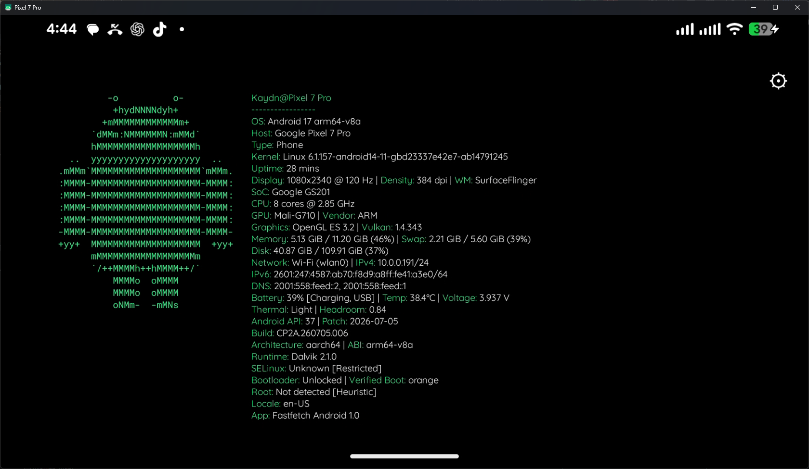
  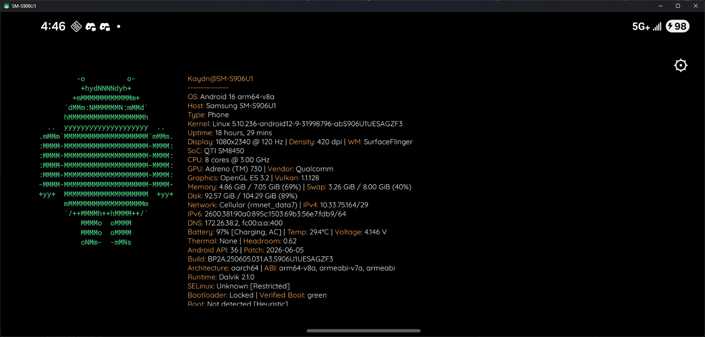
  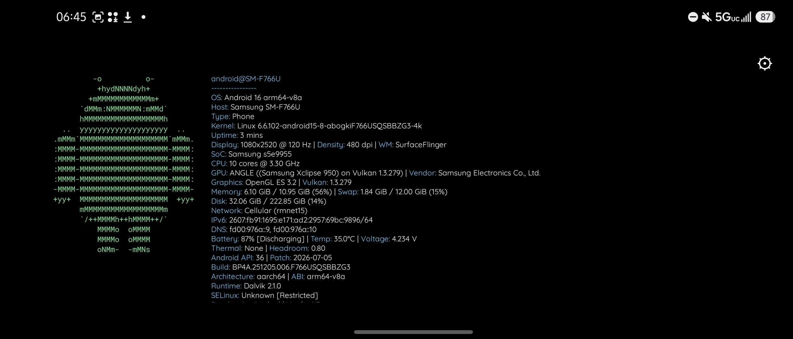
  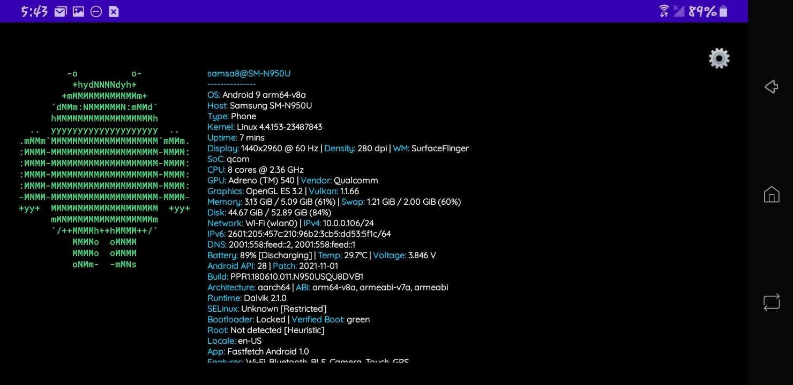

  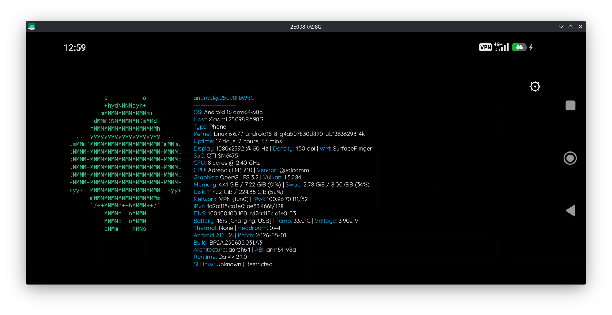
  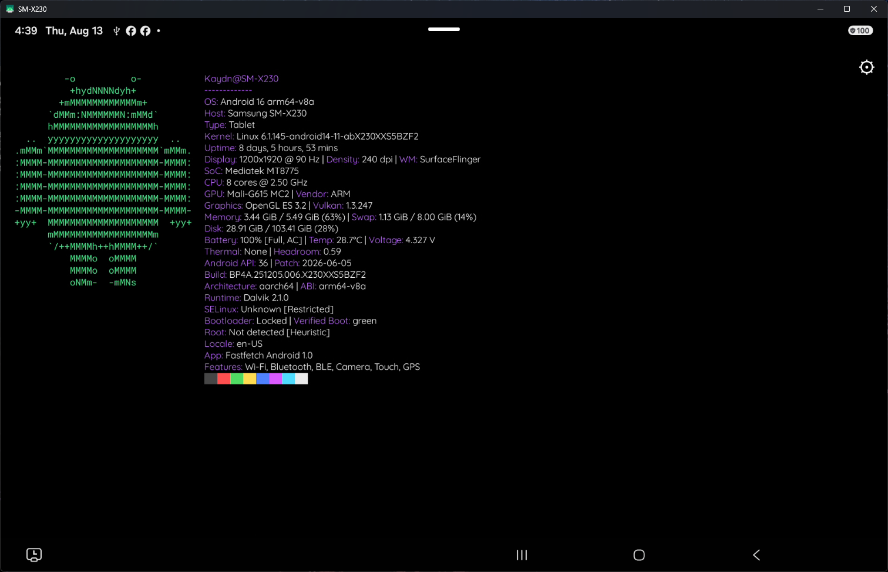

### Wear OS

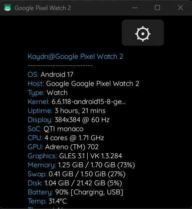

### Android TV

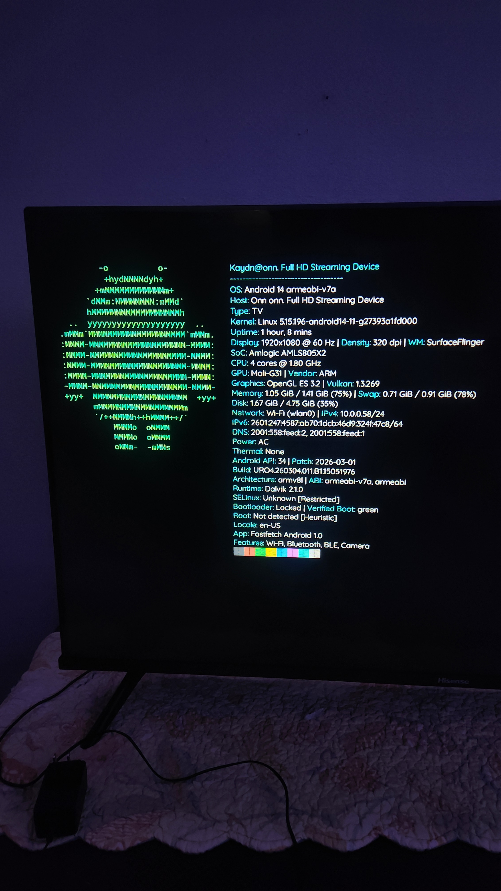

### VR

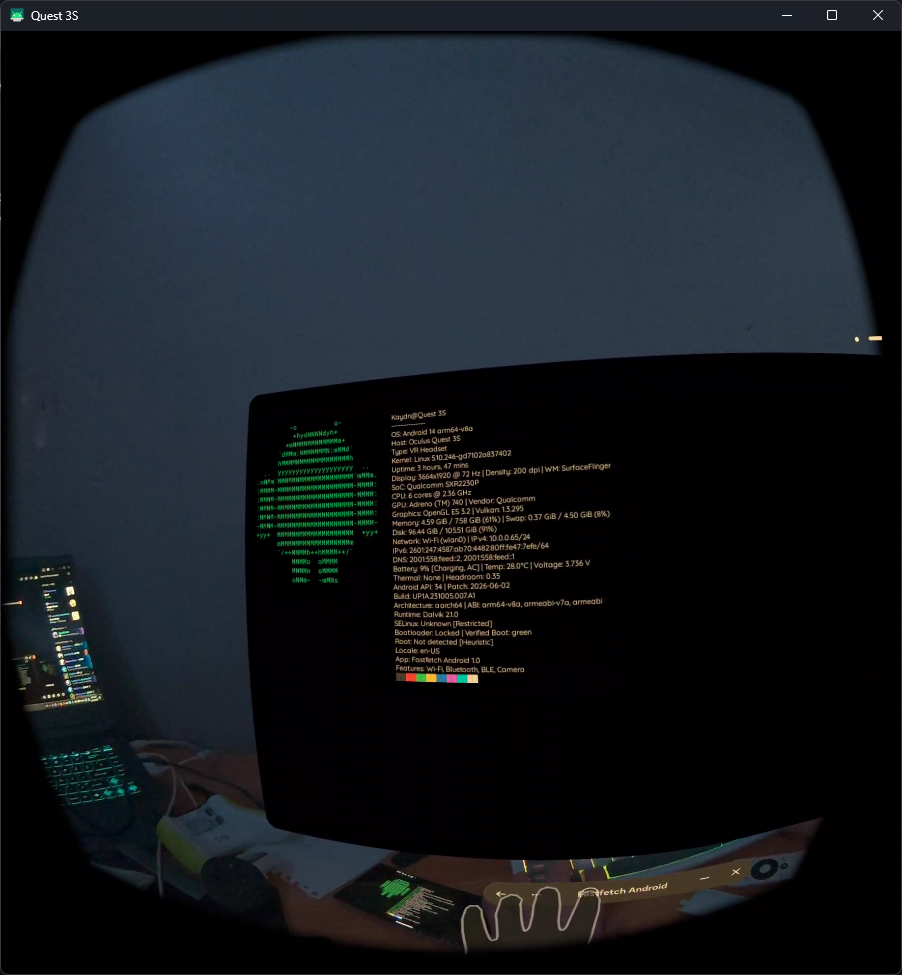

### Emulator

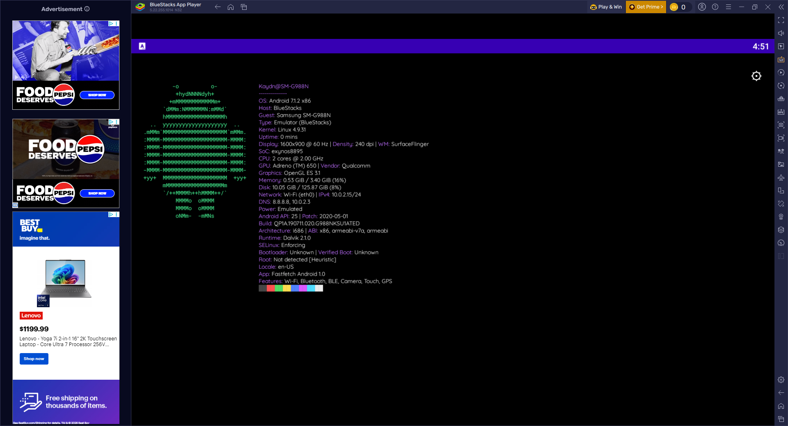

### Settings

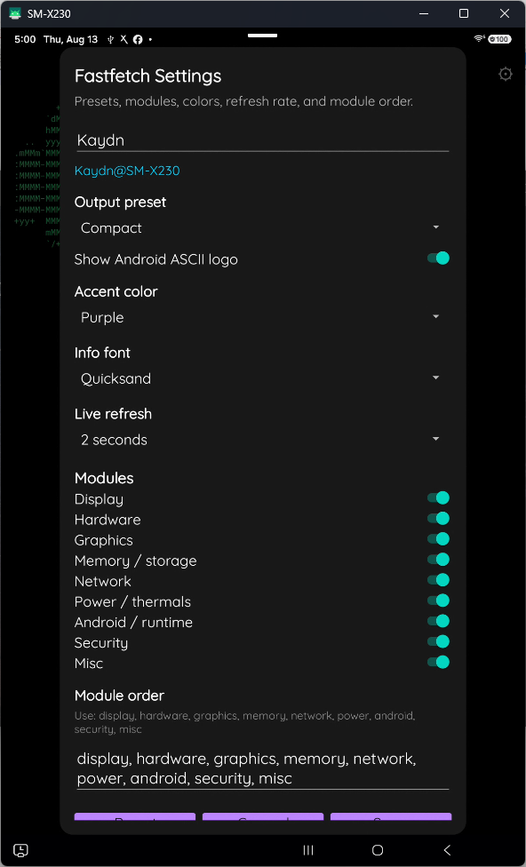

## Bugs

If you find any bugs, please let me know and tell me what device you're using and what happened.

## Testing

If you want to test Fastfetch Android on another device, go right ahead!

If it works, let me know what device you tested it on and I'll add it to the tested devices list.

## Suggestions

If you have any suggestions for what I should add next, just let me know! I'll add them eventually.

Thanks!
