# Fastfetch Android Screenshots

This page contains the full screenshot gallery for Fastfetch Android, including current device screenshots, alternate captures, and a few early development builds from our testing history.

[← Back to the main README](README.md)

## Phones

### Google Pixel 7 Pro

### Samsung Galaxy S22+

### Samsung Galaxy Z Flip 7

Alternate capture:

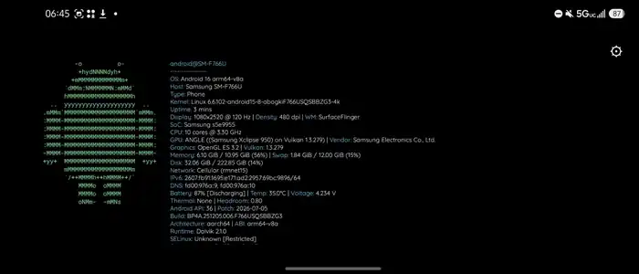

### Samsung Galaxy Note 8

### Xiaomi Redmi Note 14 4G

Community screenshot shared during testing:

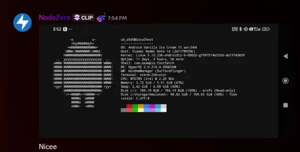

### Xiaomi Redmi Note 15 5G

Alternate capture:

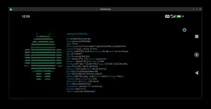

## Tablets

### Samsung Galaxy Tab A11+

Alternate capture:

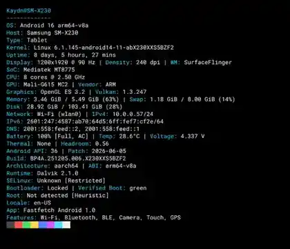

## Wear OS

### Google Pixel Watch 2

## Android TV

### onn. Full HD Streaming Device

## VR

### Meta Quest 3S

## Emulators

### BlueStacks

## Android on PC

### ChromeOS / ARCVM — HP Chromebook 11 G9 EE

Extended view running under ChromeOS's Android 13 ARCVM environment:

## Settings

Current settings interface:

Earlier module and live-refresh settings:

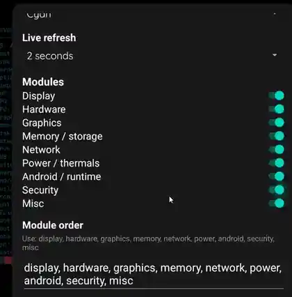

## Development History

These are older Fastfetch Android screenshots from while the app was being built and expanded. They are kept here because they show how the output evolved over time.

### Galaxy S22+ — earliest native output

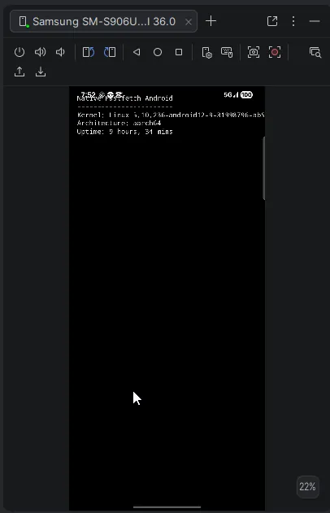

### Galaxy S22+ — early full-screen native output

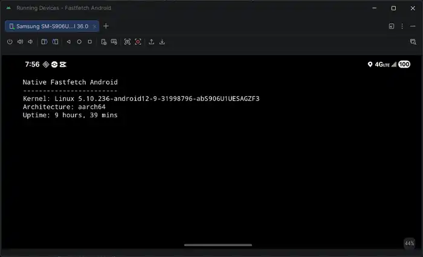

### Galaxy S22+ — expanded device information

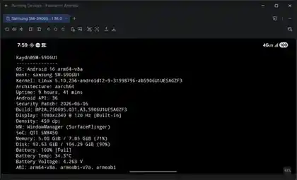

### Galaxy S22+ — Android ASCII logo added

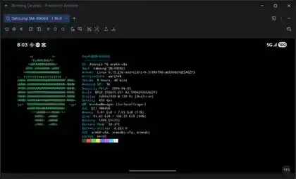

### Galaxy S22+ — CPU and swap information added

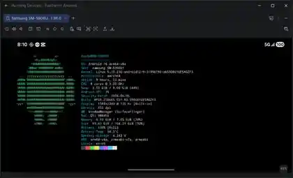

### Galaxy S22+ — GPU and graphics information added

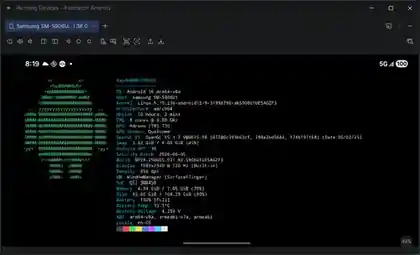

### Galaxy S22+ — Vulkan and SELinux information added

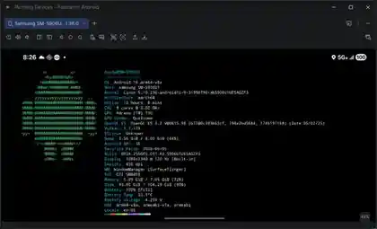

---

Have a screenshot from another device or platform? Feel free to submit it along with the device model and Android version.
